# Руководство по проекту: как всё устроено и работает

Этот документ — **единая точка входа** для читателя, который хочет понять проект целиком: постановку задачи, поток данных, код, интерфейс, артефакты и сопутствующие материалы. Остальные файлы в `docs/` углубляют отдельные темы.

---

## 1. Назначение проекта

**Тема:** разработка нейросетевой модели бинарной классификации для оценки **риска поездки** в контексте каршеринга.

| Класс | Смысл |
|-------|--------|
| **0** | поездка в категории «норма» |
| **1** | «повышенный риск» (проблемная поездка по разметке / правилу генератора) |

**На вход** модели подаётся вектор признаков поездки и пользователя (числовые и категориальные поля после препроцессинга). **На выходе** — вероятность класса «риск» и бинарное решение относительно **порога** (по умолчанию `0.5`, задаётся в конфиге).

**Важно:** в демонстрационном режиме данные **синтетические**; целевая переменная формируется генератором по осмысленным правилам, но это **не** реальная выгрузка оператора. Архитектура рассчитана на замену CSV на реальные данные при сохранении контракта колонок (см. `docs/03_data_description.md`).

---

## 2. Сквозной поток: от файла до прогноза

Ниже логика **одного полного цикла**, которую повторяют UI «Обучение» и скрипт `scripts/train.py`.

```mermaid
flowchart LR
  A[CSV data/raw] --> B[Загрузка и валидация]
  B --> C[Stratified split train val test]
  C --> D[Fit препроцессора только на train]
  D --> E[Transform всех сплитов]
  E --> F[Обучение MLP PyTorch]
  F --> G[Сохранение model.pt preprocessor.joblib]
  G --> H[Метрики на test]
  H --> I[Инференс: сырой ряд признаков]
  I --> J[Transform тем же preprocessor]
  J --> K[Сеть -> вероятность -> порог]
```



1. **Сырьё:** CSV в `data/raw/` (путь в `configs/config.yaml` → `paths.raw_data`).
2. **Валидация:** проверка наличия колонок и типов по схеме (`app/data/schema.py`), списки признаков — в `app/features/build_features.py`.
3. **Разбиение:** стратифицированное `train / val / test` (`app/data/split.py`). **Тест** не участвует в обучении и подборе весов.
4. **Препроцессинг:** `sklearn` `ColumnTransformer` — масштабирование числовых признаков, imputation пропусков, one-hot категорий (`app/data/preprocessing.py`). **Fit только на train**, затем `transform` для val/test и при любом прогнозе.
5. **Модель:** полносвязная сеть `TabularMLP` (`app/models/net.py`): линейные слои, активация, dropout, опционально batch norm.
6. **Обучение:** бинарная кросс-энтропия с логитами, оптимизатор Adam, early stopping по валидации (`app/models/train.py`). Положительный класс может взвешиваться (`pos_weight`), если классы несбалансированы.
7. **Артефакты:** веса, joblib препроцессора, дамп метаданных (`training_config.json`), история эпох, метрики на тесте, матрица ошибок, отчёты — в `artifacts/` (пути в конфиге).
8. **Прогноз:** сырой `DataFrame`/`dict` с колонками признаков → `transform_features` → тензор → сигмоида от логита → сравнение с порогом (`app/models/predict.py`, обёртки в `app/services/inference_service.py`, `prediction_service.py`).

---

## 3. Архитектура кода (слои)

Принцип: **UI и API не содержат математики обучения** — они вызывают **сервисы**, сервисы собирают `data` + `models`.

| Каталог / модуль | Роль |
|------------------|------|
| `app/features/build_features.py` | Единственный источник имён колонок: числовые, категориальные, идентификаторы, `target_class`. |
| `app/data/` | Загрузка CSV, схема, сплиты, препроцессинг, `Dataset` для PyTorch. |
| `app/models/` | Сеть, цикл обучения, метрики, сохранение артефактов, predict, baselines/benchmark (исследования). |
| `app/services/` | Оркестрация: обучение, оценка, данные для UI, статус проекта, инференс для API/UI. |
| `app/ui/` | Streamlit: навигация, `views/*`, русские подписи (`russian_ui.py`), конфиг демо-прогноза. |
| `app/api/` | FastAPI: health, информация о модели, predict / batch. |
| `app/core/` | Конфигурация (YAML + env), логирование, Pydantic-схемы API. |
| `scripts/` | Тонкие точки входа: генерация данных, train, evaluate, запуск UI и т.д. |

**Запрещённые смешения** (чтобы не ломать воспроизводимость): не делать `fit` препроцессора на val/test; не считать финальную качество только на train; в UI не вызывать напрямую `train_tabular_classifier`, минуя `training_service`.

Подробное дерево файлов: [PROJECT_STRUCTURE.md](PROJECT_STRUCTURE.md).

---

## 4. Конфигурация

Основной файл: **`configs/config.yaml`**.

| Секция | Что задаёт |
|--------|------------|
| `paths.*` | Пути к сырью, `processed`, `model.pt`, препроцессору, метрикам, отчётам, истории обучения. |
| `data.*` | Имя целевой колонки, доли test/val, seed. |
| `training.*` | Batch size, эпохи, LR, weight decay, early stopping, `num_workers`. |
| `model.*` | Скрытые слои, dropout, активация, batch norm. |
| `inference.*` | Порог классификации для бинарного решения. |

Переменные окружения могут переопределять пути (см. `app/core/config.py`, `.env.example`). В Streamlit часть гиперпараметров можно временно менять в форме обучения — они подмешиваются через `app/services/config_helpers.py`.

---

## 5. Артефакты после обучения

Типичный набор (точные пути — из `config.yaml`):

| Файл | Содержание |
|------|------------|
| `artifacts/models/model.pt` | Веса MLP + метаданные внутри чекпойнта. |
| `artifacts/models/training_config.json` | Размерность входа, параметры модели, порог, seed, время обучения. |
| `artifacts/encoders/preprocessor.joblib` | Обученный `ColumnTransformer`. |
| `data/processed/test_split.csv` | Отложенный тест (для переоценки и воспроизводимости). |
| `artifacts/metrics/test_metrics.json` | Accuracy, precision, recall, F1, ROC-AUC, матрица ошибок, кривые ROC/PR (после актуального кода), размер теста и др. |
| `artifacts/metrics/training_history.json` | Потери и F1 по эпохам. |
| `artifacts/reports/confusion_matrix.png` | Картинка матрицы ошибок (подписи на русском). |
| `artifacts/reports/classification_report_test.txt` | Текстовый отчёт sklearn. |
| `artifacts/reports/model_report.md` | Краткий markdown-отчёт. |

Кнопка **«Пересчитать метрики»** в разделе результатов снова прогоняет сохранённую модель по `test_split.csv` и обновляет метрики и отчёты.

---

## 6. Интерфейс Streamlit и связь с кодом

Точка входа: **`app/ui/streamlit_app.py`**. Страницы — функции `render()` из `app/ui/views/`.

| Раздел UI | Назначение | Ключевой код |
|-----------|------------|--------------|
| О проекте | Цель, статус, артефакты | `project_about_view.py`, `status_service.py` |
| Постановка задачи | Формулировка ВКР | `problem_statement_view.py` |
| Данные | Генерация/загрузка CSV, полная таблица, графики, описание признаков | `data_view.py`, `data_service.py` |
| Предобработка | Объяснение пайплайна до вектора признаков | `preprocessing_view.py` |
| Обучение | Параметры, запуск, графики по эпохам | `training_view.py`, `training_service.py` |
| Результаты и метрики | Метрики, ROC/PR, матрица, интерпретация | `evaluation_view.py`, `evaluation_service.py` |
| Демонстрация прогноза | Сценарии, ручной ввод, таблица признаков, объяснение | `prediction_demo_view.py`, `prediction_service.py`, `prediction_demo_config.py` |
| Практическая ценность | Внедрение и ограничения | `practical_value_view.py` |
| Справка | Команды и помощь | `help_view.py` |

Русские подписи признаков и метрик: **`app/ui/russian_ui.py`**.

---

## 7. API (FastAPI)

Запуск: `uvicorn app.api.main:app --reload` (порт по умолчанию 8000). Маршруты версии `v1`: здоровье, информация о модели, одиночный и пакетный прогноз. Сервис инференса поднимается через зависимости (`app/api/deps.py`), внутри — те же артефакты, что и у Streamlit.

Примеры запросов: [06_api_usage.md](06_api_usage.md).

---

## 8. Скрипты командной строки

| Скрипт | Назначение |
|--------|------------|
| `scripts/generate_demo_data.py` | Синтетический CSV в `data/raw/`. |
| `scripts/prepare_data.py` | Валидация и профиль сырья. |
| `scripts/train.py` | Обучение без UI (тот же пайплайн, что и кнопка в Streamlit). |
| `scripts/evaluate.py` | Пересчёт метрик на тесте. |
| `scripts/predict.py` | Пример инференса из CLI. |
| `scripts/launch_ui.py` | Запуск Streamlit. |
| `scripts/compare_baselines.py` | Baselines и ablation (см. `docs/09_baselines_and_ablations.md`). |

---

## 9. Метрики и как их читать

На **отложенном тесте** считаются, среди прочего: **accuracy**, **precision**, **recall**, **F1**, **ROC-AUC**, матрица ошибок **при фиксированном пороге**. ROC-AUC отражает качество **ранжирования** по вероятности и не привязан к одному порогу. В каршеринге отдельно обсуждают **ложные тревоги (FP)** и **пропуски риска (FN)** — это связано с выбором порога и бизнес-приоритетами.

Детали: [05_metrics_and_validation.md](05_metrics_and_validation.md), раздел «Результаты» в UI.

---

## 10. Тесты и качество кода

```bash
pytest
```

Тесты покрывают API, базовую логику метрик и часть пайплайна. Линтеры: `black`, `ruff`, `isort` (см. README).

---

## 11. Docker и публикация

Сборка UI: `Dockerfile.ui`, `docker compose` — см. [07_deployment.md](07_deployment.md) и корневой README. **Streamlit Community Cloud** требует репозиторий на GitHub; локальная папка без `git push` к облаку не подключается.

---

## 12. Карта документации `docs/`

| Документ | Для кого и зачем |
|----------|------------------|
| **PROJECT_GUIDE.md** (этот файл) | Целостное понимание проекта |
| [PROJECT_STRUCTURE.md](PROJECT_STRUCTURE.md) | Дерево файлов и границы модулей |
| [01_problem_statement.md](01_problem_statement.md) … [07_deployment.md](07_deployment.md) | Поэтапная инженерная документация |
| [03_data_description.md](03_data_description.md) | Контракт колонок CSV |
| [04_modeling_decisions.md](04_modeling_decisions.md) | Выбор модели и обучения |
| [05_metrics_and_validation.md](05_metrics_and_validation.md) | Метрики и валидация |
| [08_data_pipeline.md](08_data_pipeline.md) | Пайплайн данных |
| [DIPLOMA_THESIS_BASE.md](DIPLOMA_THESIS_BASE.md) | Черновик формулировок для ВКР |
| [defense_demo_guide.md](defense_demo_guide.md) | Сценарий показа на защите |
| [defense_narrative.md](defense_narrative.md) | Тексты к слайдам/экранам |

---

## 13. Краткий чеклист для нового разработчика

1. Прочитать разделы 1–3 этого руководства и [03_data_description.md](03_data_description.md).
2. Запустить UI, пройти разделы «Данные» → «Обучение» → «Результаты» → «Прогноз».
3. Открыть `app/features/build_features.py` и проследить использование колонок в `preprocessing.py` и `schema.py`.
4. При смене признаков: обновить списки в `build_features.py`, схему, генератор данных и тесты контракта.

Если что-то в коде расходится с этим руководством, приоритет у **фактического поведения в репозитории** — тогда стоит обновить документ.
